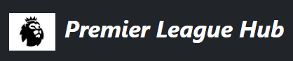
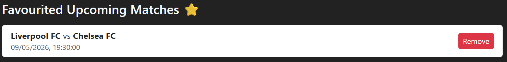

A responsive football web application featuring premier league that allows users to view upcoming matches, completed results, and top scorers using the Football-Data API. Users can also favourite upcoming matches and manage them in favourites tab.

## 💡 Background & Motivation

Football is one of the most popular sports worldwide, and fans often rely on multiple platforms to keep track of match schedules, results, and player statistics.

This project was created to provide a simple, clean, and user-friendly interface for football fans to quickly access key information such as upcoming matches, completed results, and top scorers in one place.

A key motivation behind this application was to go beyond just displaying data by introducing a favourites feature, allowing users to save and manage matches they are interested in. By integrating Airtable, the app demonstrates how real-world applications handle persistent data through CRUD operations (Create, Read, Update, Delete).

From a development perspective, this project was also an opportunity to:

- Work with real-world APIs (Football-Data API)
- Practice handling asynchronous data fetching in React
- Implement state management and component-based architecture
- Integrate a backend-like service (Airtable) without building a full backend
- Build a responsive UI using Bootstrap

Overall, this application reflects both a passion for football and a focus on building practical, real-world web development skills.

## ✨ Features

- View upcoming matches:

  

- View completed match results:

  

- View top scorers leaderboard:

  

- Add matches to favourites:

  

- Remove matches from favourites
- Persist favourites using Airtable (CRUD operations)
- Responsive UI built with Bootstrap

## 🛠️ Tech Stack

- Frontend: React
- Styling: Bootstrap
- Languages: Javascript, HTML, CSS
- API: Football-Data API
- Database: Airtable
- HTTP Client: Axios / Fetch

## 🔌 API Integration

This app uses the Football-Data API to fetch:

- Upcoming matches (fixtures)
- Completed matches (results)
- Top scorers

🔗 https://www.football-data.org/

## ☁️ Airtable Integration

Airtable is used to manage favourites:

- Create → Add a match to favourites
- Read → Fetch saved favourite matches
- Update → (Optional enhancements)
- Delete → Remove a match from favourites

## ⚙️ Installation

1. Clone the repository
2. git clone https://github.com/kenneth-wong94/Premier-League-Hub
3. Navigate into the project
4. cd Premier-League-Hub
5. Install dependencies
6. npm install
7. Start the development server
8. npm run dev

## 🔑 Environment Variables

Create a .env file in your root directory:

- VITE_FOOTBALL_API_KEY=your_api_key
- VITE_AIRTABLE_API_KEY=your_airtable_key
- VITE_AIRTABLE_BASE_ID=your_base_id

## Component tree

```
App
├── Navbar
├── Routes
│
├── Home
│ ├── UpcomingMatches
│ │ └── MatchCard
│ │
│ ├── HomeCompletedMatches
│ │
│ └── TopScorers
│
├── AllMatches
│ └── MatchCard
│
├── CompletedMatches
│ └── ResultCard
│
├── Favourites
│
└── ErrorComponent
```

## 🔥 Future Improvements

- User authentication
- Show live matches
- Searchbar to search for live & upcoming matches
- Enhance UI/UX animcations

## 👤 Creator

- Kenneth Wong
